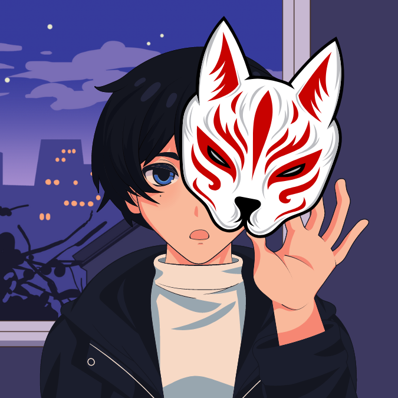

<h2 align="center">Hi, I'm Truong Cipher 👋</h2>

### 💫 About Me

> 🔭 **Current Role**: Full Stack Developer & App Developer
>  
> 🌱 **Learning Goals**: AI, Cross-platform App, UI/UX design
>  
> 👯 **Collaboration Interests:** Web and mobile development projects
>  
> 🤔 **Seeking Help With:** Data structure, iOS mobile development
>  
> 💬 **Ask Me About:** C/C++, Python, HTML5, CSS3, JavaScript
>  
> 📫 **Contact Me By Email:** [ngoquangtruong.personal@gmail.com](mailto:ngoquangtruong.personal@gmail.com) > 
> 😄 **Pronouns:** He/Him or Bắp🌽.
>  
> ⚡ **Fun Fact:** I am a sonder – aware of the complex lives of those around me. I enjoy making others happy and sharing my knowledge with them. I love engaging in both indoor and outdoor activities.

### 📫 Reach me on my social:

  
  
  
  
  
  
  
  

### 💻 My skills and Tech Stack:

  
  
  
  
  
  
  
  
  
  
  
  

### 📊 GitHub Stats and Activities:

<table style="width:100%;">
  <tr>
    <td>
      
        
    </td>
    <td>
      
 
        
      

    </td>
  </tr>
</table>

---

