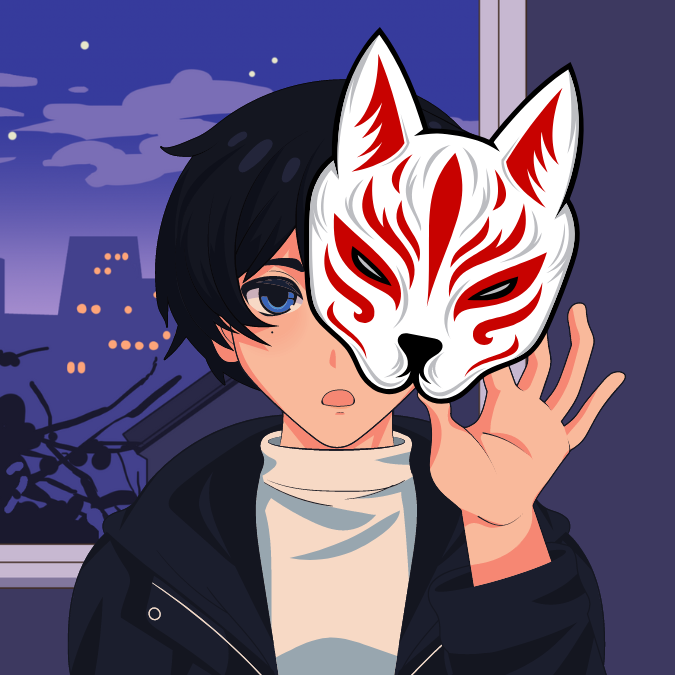
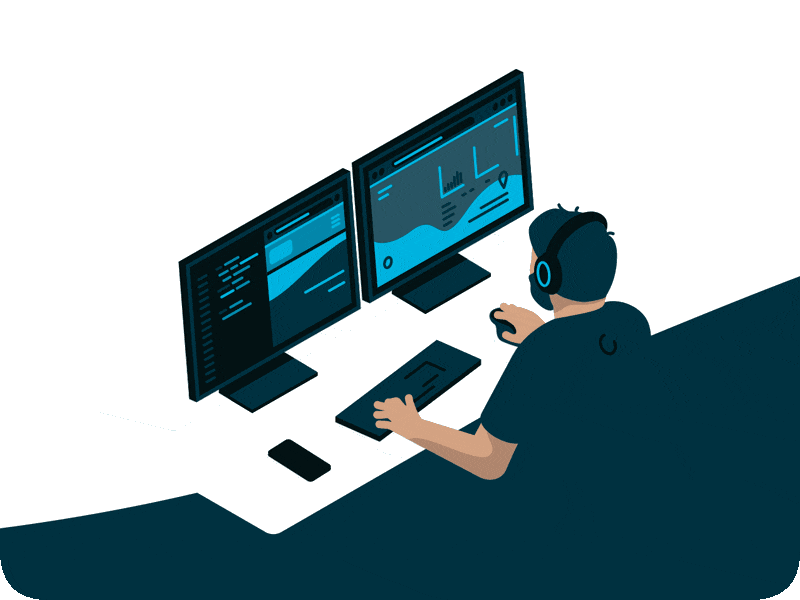

<h2 align="center">Hi, there 👋</h2>

### 💫 About Me

> 🎓 **Current Role:**  IT Student (Software Technology) at University of Sciences, Hue University Việt Nam
> 🌱 **Learning Focus:** Full-stack web development, mobile apps and artificial intelligence
> 👯 **Interested In:** Building real-world systems
> 💬 **Ask Me About:** C/C++, Java, Python
> 📫 **Email:** [ngoquangtruong.isme@gmail.com](mailto:ngoquangtruong.isme@gmail.com)  
> 📞 **Phone:** [(+84)3xx.x4x.xx5](tel:0339140405)
> 😄 **Nickname:** Pha (or Bắp🌽)  
> ⚡ **Fun Fact:** I love learning new things, building cool projects, and helping others grow

### 📫 Reach me on my social:

  
  
  

### 💻 My skills and Tech Stack:

  
  
  
  
  
  
  
  
  
  
  
  
  
  
  
  
  

### 📊 GitHub Stats and Activities:
<table style="width:100%;">
  <tr>
    <td width="50%">
      
       
      
    </td>
    <td width="50%">
      
 
        
      

    </td>
  </tr>
</table>

---

  

