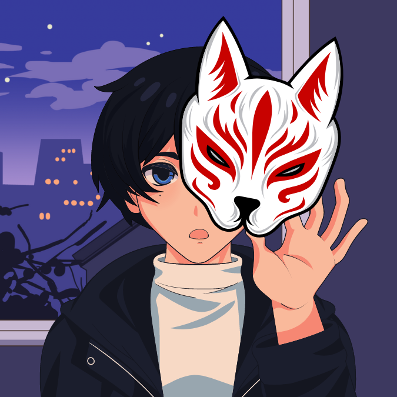

<div align="center">
  

  <h2>Truong Quang Ngo &nbsp;·&nbsp; TruongPersonal</h2>

  <p>
    
    &nbsp;
    
  </p>
</div>

---

## `$ whoami`

<table>
  <tr>
    <td width="30%" valign="top">

```yaml
name       : Ngo Quang Truong (Pha / Bắp 🌽)
role       : IT Student — Software Engineering
university : University of Sciences, Hue University · Viet Nam
focus      : Full-stack · Mobile · AI
currently  : Building real-world systems & learning every day
```

  </td>
  <td width="70%" align="center" valign="middle">
    
  </td>
  </tr>
</table>

---

## `$ cat contact.json`

<table>
  <tr>
    <td width="55%" valign="top">

```json
{
  "email"    : "ngoquangtruong.isme@gmail.com",
  "phone"    : "(+84) 339.140.405",
  "linkedin" : "linkedin.com/in/truongpersonal",
  "facebook" : "facebook.com/TruongPersonal",
  "youtube"  : "youtube.com/@TruongPersonal",
  "discord"  : "truongpersonal"
}
```

  </td>
  <td width="45%" align="center" valign="middle">
    <a href="https://www.linkedin.com/in/truongpersonal/" target="_blank">
      
    </a>
    <br/><br/>
    <a href="https://facebook.com/TruongPersonal" target="_blank">
      
    </a>
    <br/><br/>
    <a href="https://youtube.com/@TruongPersonal" target="_blank">
      
    </a>
    <br/><br/>
    <a href="https://discord.com/users/truongpersonal" target="_blank">
      
    </a>
  </td>
  </tr>
</table>

---

## `$ ls skills/`

<table>
  <tr>
    <td width="25%" valign="top">
      <b>Languages</b><br/><br/>
      <br/>
      <br/>
      <br/>
      <br/>
      <br/>
      
    </td>
    <td width="25%" valign="top">
      <b>Frontend</b><br/><br/>
      <br/>
      <br/>
      <br/>
      <br/>
      
    </td>
    <td width="25%" valign="top">
      <b>Backend & Database</b><br/><br/>
      <br/>
      <br/>
      
    </td>
    <td width="25%" valign="top">
      <b>Tools</b><br/><br/>
      <br/>
      <br/>
      
    </td>
  </tr>
</table>

---

## `$ git log --stat`

<table>
  <tr>
    <td width="35%" valign="top">
      
      <br/>
      
    </td>
    <td width="65%" valign="middle">
      
    </td>
  </tr>
</table>

---

<div align="center">
  
</div>

---

<div align="center">
  <sub><code>while (alive) { eat(); sleep(); code(); repeat(); }</code></sub>
</div>